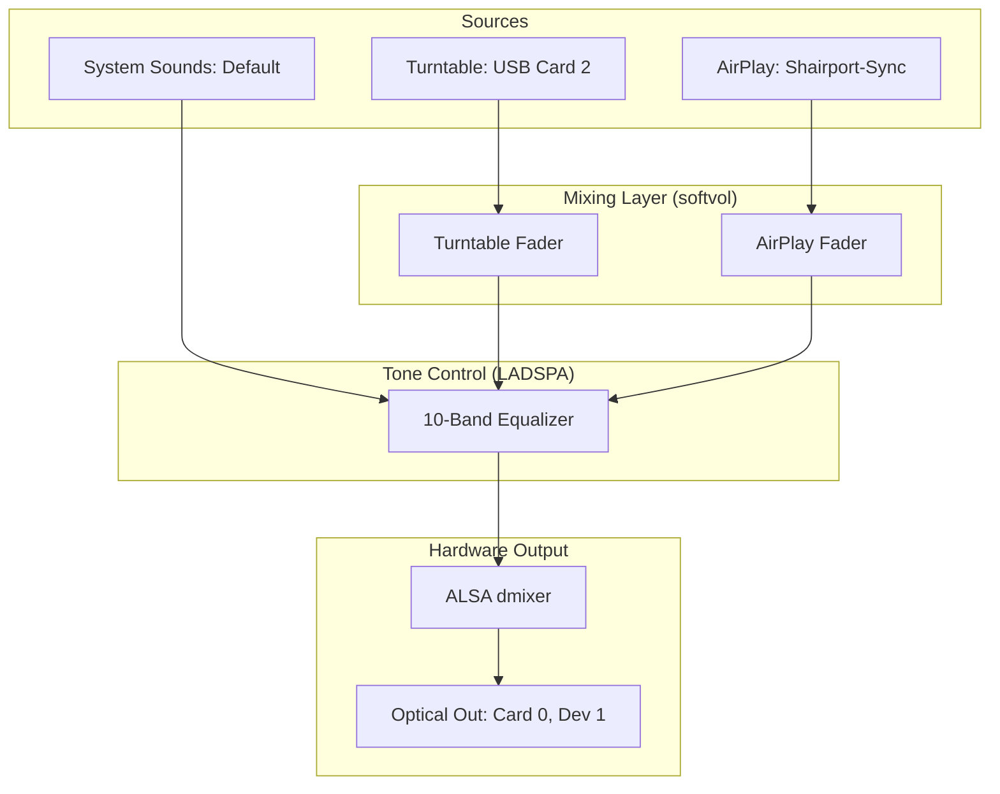
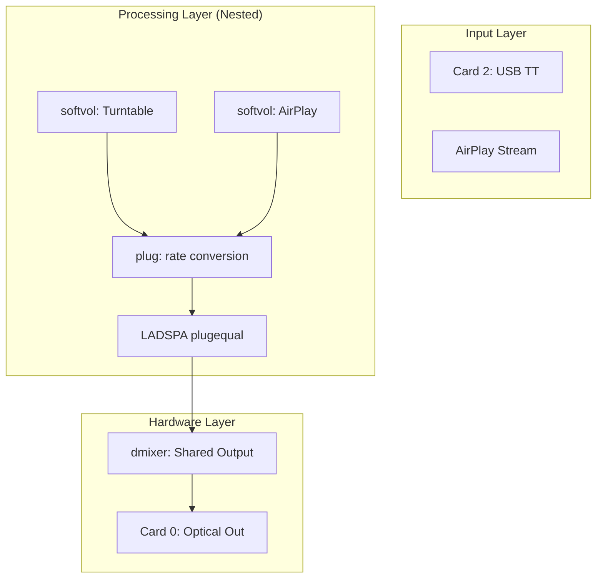
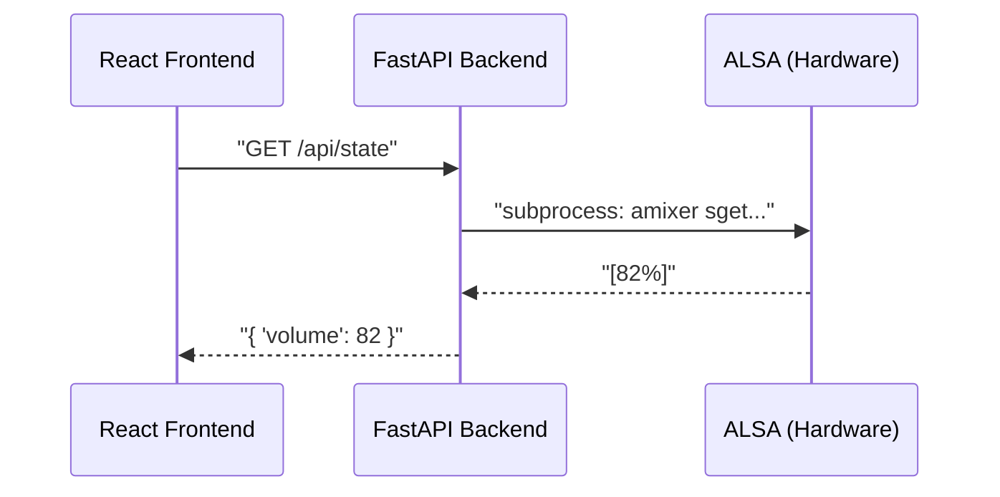
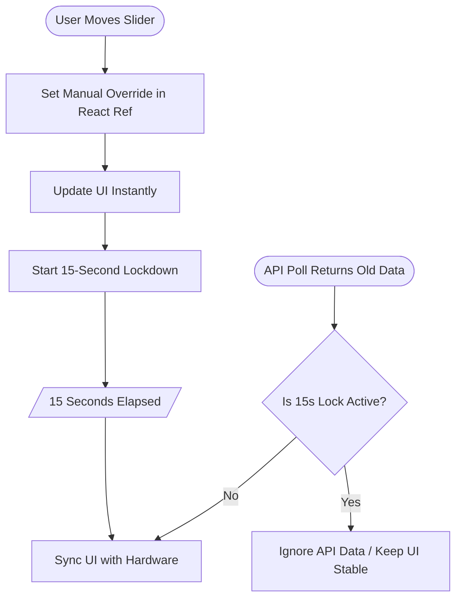
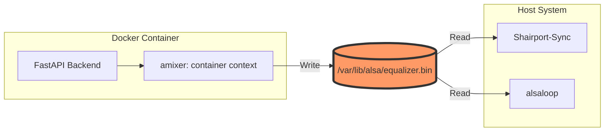

<script src="https://cdn.jsdelivr.net/npm/mermaid/dist/mermaid.min.js"></script>
<script>mermaid.initialize({startOnLoad:true});</script>
<style>
    @import url('https://fonts.googleapis.com/css2?family=Inter:wght@300;400;600;700&display=swap');
    
    @page {
        margin: 30mm 25mm;
    }

    body { 
        font-family: 'Inter', -apple-system, BlinkMacSystemFont, "Segoe UI", Roboto, sans-serif; 
        line-height: 1.7; 
        color: #1a1a1a; 
        font-weight: 400;
        text-align: justify;
    }

    .mermaid { background: white; margin: 3em 0; padding: 1em; }
    
    h1 { page-break-before: always; font-weight: 700; font-size: 2.2em; margin-top: 0; padding-bottom: 0.5em; border-bottom: 1px solid #eaeaea; }
    h1:first-of-type { page-break-before: avoid; }
    h2 { font-weight: 600; font-size: 1.6em; margin-top: 2em; color: #333; }
    h3 { font-weight: 600; font-size: 1.2em; margin-top: 1.5em; color: #444; }
    
    p, li { margin-bottom: 1.2em; }
    code { font-family: "SFMono-Regular", Consolas, "Liberation Mono", Menlo, monospace; background: #f6f8fa; padding: 0.2em 0.4em; border-radius: 3px; font-size: 0.9em; }
    pre { background: #f6f8fa; padding: 1.5em; border-radius: 6px; overflow: auto; margin: 2em 0; }
    pre code { background: none; padding: 0; }

    .copyright-page { page-break-after: always; text-align: center; padding-top: 30%; }
    .copyright-page h1 { border-bottom: none; font-size: 3em; }
</style>

<div class="copyright-page">
    <h1>Agent Reconstruction Manual</h1>
    <p style="font-size: 1.2em; color: #666;">A technical blueprint for Agentic Engineering</p>
    <br><br><br><br>
    <p>© 2026 Michael Untershlak</p>
    <p style="color: #888;">Proprietary & Confidential</p>
</div>

# The Audiophile’s Console
### *Building a High-Fidelity Audio Controller with Gemini & Modern Web Tech*

---

## Why Read This Book?

In the age of AI, the gap between **ideation** and **production** has collapsed. But while many can generate snippets of code, few can build complex, reliable, and hardware-integrated systems that actually work in the real world.

**This book is for you if:**
*   **You're a Beginner:** You want to move beyond "Hello World" and see how to orchestrate an AI agent to build a professional-grade full-stack app.
*   **You're an Expert:** You're tired of AI hallucinations and want a **predictable framework** for long-term project stability.
*   **You Love Hardware:** You want to see how to bridge the gap between physical physics (Turntables, ALSA) and high-performance digital logic (React, FastAPI).

**What makes this book unique?**
1.  **AI-Native Workflow:** We don't just ask AI for code; we design *with* it.
2.  **Tactical Agent Prompts:** Ready-to-use templates for every phase of development.
3.  **The Predictability Engine:** A masterclass in memory management and automated validation.

---

## © Copyright
**Author:** Michael Untershlak  
**Date:** Month 1  
*All rights reserved.*

---

## 📖 Table of Contents

1.  **Chapter 1: The AI-Native Shift – Vision & Agent Initialization**
    *   Bridging Ideation and Production
    *   The Audio Funnel Concept
    *   Masterclass Prompting: Setting the Workspace
2.  **Chapter 2: Taming the Engine – ALSA Engineering**
    *   Logic vs. Physics: The Great Mismatch
    *   Solving the PHONO vs. LINE Trap
    *   Tactical Prompting for Kernel-Level Routing
3.  **Chapter 3: The Digital Bridge – FastAPI & Hardware Logic**
    *   Hardware as the Single Source of Truth
    *   Simulated Mute & D-Bus Management
    *   Environment Stability in Docker
4.  **Chapter 4: The Tactile Interface – React & Modern UX**
    *   Creating a 'Stick-to-Thumb' Experience
    *   Haptic Feedback & Theme Harmony
    *   Solving Async Latency with the 15s Override
5.  **Chapter 5: Production Hardening – Docker & Portability**
    *   Universal Ubuntu Deployment Strategies
    *   Multi-User ALSA Synchronization
    *   Zero-Bug Deployment Pipelines
6.  **Chapter 6: The Secret Sauce – The Agentic Workspace**
    *   Memory, Planning, and Predictability
    *   Tactics for Context Optimization
    *   Integrating Hook Context as Truth
7.  **Chapter 7: The Validation Shield – Automated Synergy**
    *   Test-Driven Agentics (TDA)
    *   Empirical Bug Reproduction
    *   Building the Machine-Readable Ecosystem

---
*Back to Master Plan*

---


# Chapter 1: The AI-Native Shift – Vision, Architecture, and Agent Initialization

---
**← Back to Table of Contents** | **Next Chapter →**
---

Welcome to the new era of software engineering. This chapter isn't just about audio; it's about the **AI-Native Shift**—moving from being a "coder" to being a "System Orchestrator." 

Whether you are just starting your journey with AI agents or you are an experienced developer looking for a **predictable framework**, this guide will show you how to turn a complex hardware vision into a rock-solid reality.

## 1.1 The Hardware Vision: Why Start Here?

Most AI tutorials focus on simple Todo apps. We chose an **Reference USB Turntable Turntable** because it represents the ultimate challenge for an AI agent: **managing physical state.**

### The Problem Space
*   **The Physics:** USB input (Card 2) ➔ Optical motherboard output (Card 0).
*   **The Digital:** Simultaneous mixing of AirPlay (Shairport-Sync) and Analog Vinyl.
*   **The UX:** A tactile, zero-latency interface that feels like a $550 mixing console.

**Why this matters for you:** If you can teach an AI to manage Linux kernel audio routing and physical hardware latency, you can build *anything*.

## 1.2 The Audio Funnel: Communicating Complexity

To achieve **predictable results**, you cannot just "chat" with an AI. You must provide a mathematical or visual baseline. This Mermaid diagram is our "Source of Truth."



## 1.3 Tactical Prompting: Setting the Workspace

The difference between a successful project and a messy failure lies in the **Initialization**. Don't let the agent guess your structure—dictate it.

> **MASTERCLASS PROMPT 1: WORKSPACE INITIALIZATION**
> "Act as a Senior System Architect. We are building 'Optic Sound', a high-fidelity audio controller. I am your Human Partner. 
> 
> 1. Create a professional directory structure in `~/optic-sound`: `backend/`, `frontend/`, `docker/`, and `diagnostics/`.
> 2. Initialize a `GEMINI.md` file. This is your 'Global Mandate'. Write down these rules: 'FastAPI for backend, React/TS for frontend, Hardware is the source of truth, absolute paths only.'
> 3. Create a `PLAN.md` with a checkbox list of the 7 chapters of this book.
> 4. Generate a `set_permissions.sh` script to normalize UID 1000 across Docker and Host environments."

## 1.4 The Anonymization Strategy: Designing for Scale

A key lesson for experts: **Stop hardcoding your username.** If you want your agentic projects to be portable (deployable to any server), you must enforce universal paths.

**Key Tactic:** Use the `setgid` bit (`chmod g+s`) on all directories. This ensures that when your AI agent creates a file, it automatically inherits the correct group permissions, preventing the "Permission Denied" nightmare common in containerized hardware apps.

---
**← Back to Table of Contents** | **Next Chapter →**

---


# Chapter 2: Taming the Engine – ALSA Engineering

---
**← Back to Table of Contents** | **← Previous Chapter** | **Next Chapter →**
---

Welcome to the "engine room." In this chapter, we take our high-level vision and dive deep into the Linux kernel's audio stack. This is where we learn the most important lesson of hardware apps: **you can't fix physics with pure logic.**

## 2.1 Logic vs. Physics: The Great Mismatch

When building audio apps, the biggest hurdle is that the software's "Logic" often conflicts with the hardware's "Physics." Agents cannot "hear" audio; they rely entirely on you to establish the correct physical parameters.

### The PHONO vs. LINE Trap (Issue #1)
- **Problem:** Signal loss and extreme noise during the first test.
- **Cause:** The turntable switch was set to PHONO (raw, unamplified).
- **Decision:** Switch to **LINE** to utilize the turntable's internal preamp. **Rule for Agents:** Document that physical hardware switches MUST be validated before debugging software volume levels.

### The Background Noise Battle (Troubleshooting)
- **Problem:** Persistent electronic hiss and background "whine."
- **Mitigation A:** Run `alsamixer -c 0` and mute unused analog inputs (Line-In, Mic).
- **Mitigation B:** Increase `alsaloop` latency to 200ms (`-t 200000`) and enable double buffering (`-b`).

## 2.2 Deep Dive into `asound.conf`: The Audio Funnel

The `asound.conf` file is where the magic happens. We use it to create "Virtual Devices" that handle the mixing.

### The "No Sound" Crisis (Issue #2)
- **Problem:** `alsaloop` failed to initialize with `softvol`, reporting "Unknown PCM" and "Slave PCM not usable."
- **Decision 1 (Visibility):** Added `hint { show on }` blocks. Without these, custom PCMs are invisible to systemd services.
- **Decision 2 (Stability):** Wrapped `softvol` in **nested `plug` layers** (`plug` -> `softvol` -> `plug` -> `dmix`). This is critical for negotiating sample rate differences (48kHz capture vs 44.1kHz playback).

### The Hybrid Strategy (Architectural Decision)
- **Issue:** Fatal crashes occurred when nesting multiple software volume plugins within the EQ chain.
- **Decision:** Use a **Hybrid approach**. AirPlay uses software volume (slaved to EQ), while the Turntable uses **Direct Hardware Gain** (Card 2 `PCM`). This maintains stability while keeping high audio fidelity.

### Agent Prompt: ALSA Configuration
> **AGENT RECONSTRUCTION PROMPT 2: THE ALSA ENGINE**
> "Write the complete `/etc/asound.conf`. It must include:
> 1. A `dmixer` bound to `hw:0,1` (Optical Out).
> 2. A `plugequal` LADSPA equalizer feeding into the dmixer. The state file MUST be located at `/var/lib/alsa/equalizer.bin`.
> 3. A `softvol` device named 'AirPlay' feeding into the equalizer.
> 4. Ensure all custom devices have `hint { show on }`.
> 5. Create a `pcm.!default` that routes standard audio through the EQ."

## 2.3 Visualizing the Engine: The Nested Plugin Stack

A stable ALSA setup requires "plug" layers to bridge sample rate differences. Feed this to the agent so it understands the necessary nesting depth:



## 2.4 The Loopback Service

To get audio from the USB Turntable into the ALSA stack, we must run an `alsaloop` daemon. 

### Agent Prompt: The Systemd Daemon
> **AGENT RECONSTRUCTION PROMPT 3: HARDWARE DAEMON**
> "Create a systemd service file named `turntable-loop.service`. It must run as the standard user (not root). The ExecStart command should run `alsaloop` capturing from `hw:2,0` (Turntable) and playing to the `plug:equal` (or the default EQ device). Use flags `-t 200000` (200ms latency), `-b` (double buffering), and `-S 1` (strict sync)."

**Exact implementation reference for `turntable-loop.service`:**
```ini
[Unit]
Description=Turntable ALSA Loopback Bridge
After=sound.target

[Service]
Type=simple
User=<YOUR_USER>
ExecStart=/usr/bin/alsaloop -C hw:2,0 -P plug:equal -t 200000 -b -S 1
Restart=on-failure
RestartSec=3

[Install]
WantedBy=default.target
```

---
**← Back to Table of Contents** | **← Previous Chapter** | **Next Chapter →**

---


# Chapter 3: The Digital Bridge – FastAPI & Hardware Logic

---
**← Back to Table of Contents** | **← Previous Chapter** | **Next Chapter →**
---

How do you translate a user's tap on a screen into a physical voltage change on a motherboard? In this chapter, we build the **Digital Bridge** using Python and FastAPI. This is where the project gets "smart."

## 3.1 Architecture: Hardware as the Source of Truth

A common mistake in IoT apps is keeping a separate database for the "Volume" state. If someone changes the volume using a physical knob or a terminal command, the app gets out of sync.

**The Solution:** The backend should never "remember" the volume. It should query the hardware (ALSA) every time the UI asks.

### The Simulated Mute (Troubleshooting)
- **Issue:** Muting the Turntable or AirPlay in the app had no effect because the underlying `softvol` devices lacked a physical hardware mute switch (`pswitch`).
- **Solution:** Implemented **Simulated Mute** logic in the `ALSABridge`. When a mute request is received, the backend captures the current volume, sets the hardware level to 0%, and restores the previous level upon unmuting.

## 3.2 The `ALSABridge` Class & Environment Stability

We use Python's `subprocess` module to wrap `amixer` commands. This allows us to treat ALSA like a simple Python object.

### Missing Plugins in Docker (Issue #3)
- **Problem:** Backend logs showed persistent "Invalid CTL equal" errors.
- **Cause:** The Docker container lacked the `libasound2-plugin-equal` library required to talk to the EQ.
- **Fix:** Update the `Dockerfile` to include all necessary LADSPA and ALSA plugins.

**Lesson Learned: Unbuffered Logging**
When running in Docker or as a background service, Python often buffers `print()` statements, making debugging hardware actions impossible. Always use `print(..., flush=True)` or set the environment variable `PYTHONUNBUFFERED=1`.

### Agent Prompt: ALSA Bridge Logic
> **AGENT RECONSTRUCTION PROMPT 4: PYTHON ALSA WRAPPER**
> "Write a Python class `ALSABridge` in `backend/alsa_bridge.py`. 
> 1. Use `subprocess.run` to execute `amixer` commands.
> 2. Implement a `get_system_state()` method that parses `amixer sget` to return a JSON dictionary of current volumes (master, turntable, airplay) and EQ bands (10 bands, mapped from 31Hz to 16kHz).
> 3. Implement 'Simulated Mute' logic: if a device doesn't have a mute switch, store its volume, set to 0, and restore it later.
> 4. Use `busctl` (D-Bus) to restart the `shairport-sync` and `turntable-loop` systemd services."

## 3.3 D-Bus: Beyond systemctl & Routing Priority

### The API Interception Bug (Issue #4)
- **Problem:** Static file serving was intercepting API calls (like `/api/login`), causing "405 Method Not Allowed" errors.
- **Decision:** Move the static mount to the **end** of the FastAPI application lifecycle. This ensures that explicit API routes have priority over the compiled frontend assets.

### D-Bus Service Management
Our app needs to restart services like `shairport-sync` (AirPlay). In a Dockerized or universal Ubuntu environment, using `sudo systemctl restart` inside a script is often restricted or unreliable.

**The Pro Tip:** Use **D-Bus** via the `busctl` command. It allows the backend to talk directly to the system manager via a mounted socket, providing 100% accurate service status monitoring.

### Agent Prompt: FastAPI Server
> **AGENT RECONSTRUCTION PROMPT 5: THE REST API**
> "Write `backend/main.py` using FastAPI.
> 1. Define endpoints: `POST /api/login`, `GET /api/state`, `POST /api/volume/{source}`, `POST /api/mute/{source}`, `POST /api/eq`, and `POST /api/system/restart`.
> 2. Use `ALSABridge` to fulfill these requests.
> 3. Implement a simple cookie-based authentication dependency (`Depends(get_current_user)`). The PIN should be read from an `ACCESS_PIN` environment variable.
> 4. Mount a `static/` directory at the root (`/`) to serve the React frontend, but ensure this mount happens *after* all API routes are defined."

## 3.4 Visualization: The Request Flow

Provide this to the agent to clarify the expected latency and sync process:



---
**← Back to Table of Contents** | **← Previous Chapter** | **Next Chapter →**

---


# Chapter 4: The Tactile Interface – React & Modern UX

---
**← Back to Table of Contents** | **← Previous Chapter** | **Next Chapter →**
---

Audio is tactile. If the UI feels sluggish, the sound *feels* worse. In this chapter, we transition from backend logic to high-performance UX, building a React interface that responds with the snap and precision of a $550 physical mixing desk.

## 4.1 The "Gold & Charcoal" Aesthetic

For an audiophile app, the visual design must reflect the quality of the sound. We used **Tailwind CSS** to create a dark, high-contrast theme:
*   **Background:** Deep Charcoal (`#121212`).
*   **Accents:** Metallic Gold and Electric Blue.
*   **Typography:** Ultra-thin, tracking-heavy headers for a "technical" feel.

### The CSS Purging Crisis (Issue #5)
- **Problem:** Styles were not loading in production, resulting in an "ugly" UI.
- **Cause:** Tailwind was purging necessary classes because the `content` glob in `tailwind.config.js` was too restrictive.
- **Fix for Agents:** Ensure the Tailwind configuration explicitly includes all React source files: `content: ["./index.html", "./src/**/*.{js,ts,jsx,tsx}"]`.

## 4.2 The Thumb-First Slider Model

Native HTML5 `<input type="range">` elements are problematic on mobile. They are difficult to grab and often trigger page scrolling instead of changing the volume.

**The Solution:** Build a custom React slider that listens to `touchstart` and `touchmove` events directly. 
*   **Locking:** Use `e.preventDefault()` to lock the screen while dragging.
*   **Hit Zones:** Add invisible padding around the slider to make it "easy to grab" with a thumb.

### Agent Prompt: The Custom Slider
> **AGENT RECONSTRUCTION PROMPT 6: TACTILE SLIDER COMPONENT**
> "Write a React component `VerticalSlider.tsx`. It must NOT use `<input type='range'>`. 
> 1. Use a generic `div` with `onTouchStart`, `onTouchMove`, and mouse equivalents to track the Y-coordinate.
> 2. Calculate the percentage (0-100) based on the bounding client rect.
> 3. When dragging, bypass React state updates for the visual position if possible, or use a highly optimized local `dragValue` state to ensure 60fps rendering without waiting for backend network requests.
> 4. Trigger `window.navigator.vibrate(5)` on every distinct value change."

## 4.3 Haptic Feedback & Theme Harmony

### Dual Environment Support (New Feature)
- **Action:** Implemented a theme system supporting both **Night (Dark)** and **Light (Day)** modes.
- **UX Decision:** Added smooth 500ms color transitions and haptic confirmation for theme toggling.

### Visibility Troubleshooting
- **Problem:** The 0dB guide lines (crucial for "Flat" EQ) were nearly invisible in Light mode.
- **Fix:** Increased guide line opacity to **80%** in Light mode and used a darker **Blue-600** for the AirPlay fader to ensure contrast against light backgrounds.

## 4.4 The 15-Second State Persistence Rule

One of the hardest bugs to solve was the "Jumping Slider." When you move a slider, the backend takes a moment to update the hardware. If the app polls the state during this window, it might receive the *old* value and snap the slider back to its previous position.

### The Nested State Bug (Troubleshooting)
- **Issue:** EQ sliders continued to "jump" even after the override system was built.
- **Cause:** The `manualOverrides` system was treating EQ updates as top-level properties instead of nesting them inside the `equalizer` state object.
- **Decision:** Refactor the override logic to recursively merge nested hardware states.

### Visualizing Absolute State Persistence

We use a "Manual Override" strategy to shield the UI from stale hardware data:



### Agent Prompt: State Management Architecture
> **AGENT RECONSTRUCTION PROMPT 7: STATE INTEGRITY (App.tsx)**
> "Write the main `App.tsx` routing and state management.
> 1. Set up a polling interval `setInterval(fetchState, 5000)` to query `/api/state`.
> 2. Implement the **Absolute Override System**: Create a `useRef` dictionary tracking the timestamp of user interactions.
> 3. When `fetchState` receives new data, deeply merge it with the `useRef` overrides. If an override is less than 15 seconds old, the override value MUST win, completely ignoring the API's hardware value.
> 4. Add the 'Vault' UI screen that requires the user to input a 4-digit PIN before accessing the Mixer."

---
**← Back to Table of Contents** | **← Previous Chapter** | **Next Chapter →**

---


# Chapter 5: Production Hardening – Docker & Portability

---
**← Back to Table of Contents** | **← Previous Chapter** | **Next Chapter →**
---

It's time to leave the "Development Sandbox." In this chapter, we take our fragile local setup and wrap it in a **Production-Grade Shield**. We'll learn how to build containers that can control hardware on any universal Ubuntu server with a single command.

## 5.1 Hardware Access in Docker

Docker containers are isolated by default. To control audio, the container needs direct access to the host's sound hardware.

**The Solution:**
1.  **Device Mapping:** Mount `/dev/snd` into the container.
2.  **Configuration:** Mount the host's `/etc/asound.conf`.
3.  **Network Mode:** Use `network_mode: host` to ensure mDNS and AirPlay services are visible on the local network.

### Network Security (Troubleshooting)
- **Issue:** Port 9000 was initially open to "Anywhere," posing a risk on public networks.
- **Fix:** Restrict **UFW rules** to only allow traffic from the local subnet (e.g., `192.168.1.0/24`). The control panel is now invisible to anything outside your home network.

## 5.2 The Multi-User Sync & Permission Challenge

### The "Inaudible EQ" Crisis (Issue #6)
- **Problem:** EQ changes made in the web UI had zero effect on the audio.
- **Cause:** The `alsaequal` plugin defaults to storing state in `~/.alsaequal.bin`. Since Docker, Shairport-Sync, and the audio loop were running as different users, they were looking at different state files.

### Visualizing the Shared State Architecture

To synchronize the Docker container with the Host services, we use a shared volume with broad permissions:



**The Fix:**
*   Point all ALSA configs to a shared file: `/var/lib/alsa/equalizer.bin`.
*   Mount this directory as a volume in Docker.
*   Set permissions to `666` so all users/contexts can read/write to the same "Truth."

### Automated Permission Enforcement
- **Issue:** Files created by services were sometimes owned by root, causing permission denied errors.
- **Decision:** Created a `set_permissions.sh` script using the **setgid bit** on the project directories. This ensures all new files automatically inherit the correct group permissions, regardless of which user created them.

## 5.3 CI/CD & Production Hardening

### The Multi-Stage Build Strategy
Instead of shipping a heavy development environment, we use a **Multi-Stage Dockerfile**:
1. **Stage 1 (Node):** Builds the React frontend.
2. **Stage 2 (Python):** Bundles the compiled assets into a slim FastAPI image.

### Zero-Bug Deployment (Decision)
- **Action:** Updated the `Dockerfile` to automatically run all **automated tests** (Frontend & Backend) *before* the build is finalized. If a single test fails, the build stops. This guarantees that only verified code reaches the production server.

## 5.4 The Final Agent Prompts

> **AGENT RECONSTRUCTION PROMPT 8: THE MULTI-STAGE DOCKERFILE**
> "Create a `Dockerfile`.
> 1. Stage 1 (builder): Use `node:20-alpine`. Copy `frontend/`, run `npm install`, and `npm run build`.
> 2. Stage 2 (runner): Use `python:3.12-slim`. Install `alsa-utils`, `libasound2-plugin-equal`, `swh-plugins`, and `dbus`.
> 3. Copy `backend/` and install `requirements.txt`.
> 4. Copy the built React assets from Stage 1 into the `static/` directory of the Python app.
> 5. Set the entrypoint to run the FastAPI app via `uvicorn` on port 9000."

> **AGENT RECONSTRUCTION PROMPT 9: SERVICE ORCHESTRATION**
> "Create `docker-compose.yml`.
> 1. Build the current context.
> 2. Use `network_mode: host`.
> 3. Mount `/dev/snd:/dev/snd` as a device.
> 4. Mount `/etc/asound.conf:/etc/asound.conf:ro` as a read-only volume.
> 5. Mount `/var/lib/alsa:/var/lib/alsa` as a read-write volume.
> 6. Mount `/var/run/dbus/system_bus_socket:/var/run/dbus/system_bus_socket` so Python can control systemd.
> 7. Load variables from a `.env` file."

## 5.5 Final Checklist for the Universal Ubuntu Server

1.  **Permissions:** Run `set_permissions.sh` to ensure the generic UID 1000 can access the audio devices and state files.
2.  **UFW Security:** Restrict port 9000 to your local subnet (`192.168.1.0/24`).
3.  **Environment Management:** Centralize all hardware indices in a `.env` file within the `docker/` directory for easy orchestration.

---
## Conclusion: The Path Forward

You have built a high-fidelity, tactile, and secure audio controller from scratch using Gemini. You've mastered the gap between physical hardware and modern web tech. This manual ensures that the entire stack can be instantly rebuilt, modified, and scaled by any autonomous agent.

**Now, go build something that sounds beautiful.**

---
**← Back to Table of Contents** | **← Previous Chapter** | **Next Chapter →**

---


# Chapter 6: The Secret Sauce – The Agentic Workspace

---
**← Back to Table of Contents** | **← Previous Chapter** | **Next Chapter →**
---

If Chapters 1-5 provided the body of the project, this chapter provides the **Mind**. This is the "Secret Sauce" that separates amateur AI-assisted coding from professional **Agentic Engineering**. 

## 6.1 The Strategy: Predictability by Design

Why do AI agents fail halfway through a project? Usually, it's because they lose **context**. As the project grows, the "Context Window" becomes a cluttered room where the agent can't find its keys.

**The Strategy:** Treat context as your most expensive resource. Manage it with the same rigor you apply to memory or CPU usage.

## 6.2 The Three Pillars of Agentic Memory

To achieve consistent results, you must implement these three files in your project root. They act as the agent's long-term memory:

### 1. The Mandate (`GEMINI.md`)
The "Laws" of your project. If you find yourself correcting the agent for the same mistake twice, put the fix in `GEMINI.md`.
*   *Example:* "Never use `localhost`; always use environment variables."

### 2. The Dual-Memory System (`PROGRESS.md` & `SUMMARY.md`)
We split memory into two distinct scales to manage context more efficiently:
*   **Long-Term Memory (`PROGRESS.md`):** This acts as a high-fidelity session journal. It records what was attempted, what failed, and why, across the entire project lifecycle.
*   **Short-Term Memory (`SUMMARY.md`):** A concise "state of the union" snapshot. It provides an immediate overview of the current architecture and active tasks for rapid context restoration.

*   *Key Tactic:* When starting a new session, the agent's first task should be: "Read `SUMMARY.md` for current context and `PROGRESS.md` for recent history."

### 3. The Iterative Map (`PLAN.md`)
Never let an agent write code without updating its plan first. This forces "System 2 Thinking"—deliberate, logical planning before impulsive coding.

## 6.3 Integrating "Hook Context" as Truth

In advanced agentic environments, you may receive real-time data from external sensors or system monitors. We call these **Hooks**.

**Tactics for Predictability:**
*   **Informational Truth:** Wrap hook data in `<hook_context>` tags.
*   **Read-Only Mandate:** Instruct the agent that it cannot "fix" a hook—it must adapt its logic to the hardware reality reported by the hook.

## 6.4 Agent Prompt: The Environment Setup

> **MASTERCLASS PROMPT 10: THE KNOWLEDGE BASE**
> "I want you to be a self-documenting agent. 
> 1. Create a `.geminiignore` file to exclude `node_modules`, `venv`, and `dist` from your search tools.
> 2. Initialize `SUMMARY.md` with our current status: 'Refactoring book for reader engagement' and log the start in `PROGRESS.md`.
> 3. Add a section to `GEMINI.md` titled 'Security Mandates': 'Never log secret keys, never stage changes without explicit confirmation.'"

---
**← Back to Table of Contents** | **← Previous Chapter** | **Next Chapter →**

---


# Chapter 7: The Validation Shield – Automated Synergy

---
**← Back to Table of Contents** | **← Previous Chapter**
---

The final step in our journey is the **Validation Shield**. This is where we move beyond "trusting" the agent and begin **verifying** the agent. This chapter is for those who demand 100% reliable systems.

## 7.1 The TDA Strategy: Test-Driven Agentics

In traditional dev, we have TDD (Test-Driven Development). In the agentic era, we have **TDA**.

**The Logic:** An AI agent's code is only as good as its verification. By forcing the agent to write a **FAILED TEST** first, you ensure it mathematically understands the problem before it tries to solve it.

## 7.2 The Machine-Readable Ecosystem

For an agent to be truly autonomous, it needs a way to "hear" the system's feedback.

*   **Pytest:** Verifies the ALSA Bridge logic.
*   **Vitest:** Verifies the React 15s Override logic.
*   **CI/CD:** A Dockerized test barrier that kills the build if a regression is detected.

## 7.3 Tactical Lesson: Empirical Bug Reproduction

If a user says "The slider jumped," don't let the agent guess why. Use the **Validation Shield**:

1.  **Agent Task:** "Write a Vitest case that simulates a 2000ms delay in API polling and verify if the slider state stays stable."
2.  **Result:** The test fails.
3.  **Agent Task:** "Refactor `App.tsx` until this test passes."
4.  **Outcome:** A permanent, verified fix that won't break next week.

## 7.4 Master Prompt: The Testing Mandate

> **MASTERCLASS PROMPT 11: THE VALIDATION SUITE**
> "We are moving to Production. 
> 1. Implement a comprehensive suite in `backend/tests/`. Use mocks to verify every ALSA command without needing the physical turntable connected.
> 2. Implement a behavior test in `frontend/src/App.test.tsx` that verifies the 'Vault' security PIN logic.
> 3. Update the `Dockerfile` so that a single test failure prevents the final image from being built. Our goal is **Zero-Bug Deployment**."

---
## Conclusion: The Path Forward

You have completed the transition. You are no longer just building apps—you are building **Self-Healing, Machine-Readable Environments**. 

Whether you are a hobbyist or a professional, the strategies in this book—from the **Audio Funnel** to the **Validation Shield**—will ensure your next project is built with the precision and predictability of an audiophile's dream.

**Now, go orchestrate something incredible.**

---
**← Back to Table of Contents** | **← Previous Chapter**

---


<div style="page-break-before: always; text-align: center; color: #bbb; padding-top: 45%; font-size: 0.9em;">
    <p>AGENT RECONSTRUCTION MANUAL</p>
    <p>© 2026 MICHAEL UNTERSHLAK</p>
</div>
