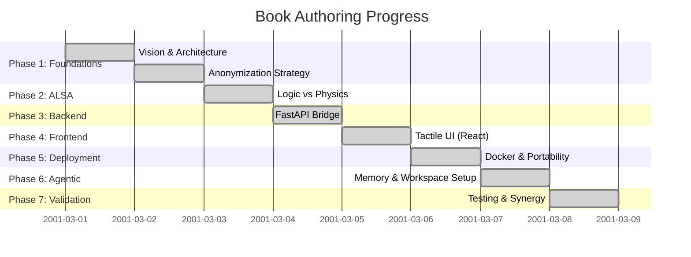

# 📘 Book Plan: The Audiophile’s Console
### *Building a High-Fidelity Audio Controller with Gemini & Modern Web Tech*

**Target Audience:** LinkedIn professionals, hobbyist developers, and audio enthusiasts.
**Goal:** A step-by-step masterclass in bridging physical hardware (Turntable) with digital controls using an AI-native workflow, optimized for any universal Ubuntu server.

---

## 📊 Roadmap & Progress

---

## 🏗️ Structural Tasks
- [x] Create `book/index.md` with Copyright (Michael Untershlak) and TOC.
- [x] Implement **Inter-chapter Navigation**: Every chapter has `[Next]`, `[Previous]`, and `[Back to Contents]` links.
- [x] Integrate **Agent Reconstruction Prompts** into every chapter.
- [x] Synchronize Lessons Learned from `PROGRESS.md` into technical chapters.

---

## 🏛️ Phase 1: The Vision & Architecture
*“How to describe a complex hardware-software bridge to an AI.”*
- **Contents:** The Audio Funnel, Mermaid routing logic, and Anonymization.
- **Status:** COMPLETE ([Chapter 1](book/chapter_1_foundations.md))

---

## 🔊 Phase 2: The Sound Machine (ALSA Engineering)
*“Taming the Linux Audio System.”*
- **Contents:** `asound.conf`, PHONO vs LINE traps, background noise mitigation, and `alsaloop` daemons.
- **Status:** COMPLETE ([Chapter 2](book/chapter_2_alsa.md))

---

## 🌉 Phase 3: The Digital Bridge (FastAPI Backend)
*“Connecting Python to the physical registers.”*
- **Contents:** Hardware as Source of Truth, Simulated Mute logic, and D-Bus integration.
- **Status:** COMPLETE ([Chapter 3](book/chapter_3_backend.md))

---

## 🎨 Phase 4: The Tactile Interface (React & UX)
*“Creating a 'Stick-to-Thumb' experience.”*
- **Contents:** Haptic feedback, custom touch-tracking sliders, and the 15s Absolute Override rule.
- **Status:** COMPLETE ([Chapter 4](book/chapter_4_frontend.md))

---

## 🐳 Phase 5: Deployment & Environment Stability
*“Dockerizing the Hardware.”*
- **Contents:** Mounting `/dev/snd`, multi-user ALSA sync, and multi-stage builds.
- **Status:** COMPLETE ([Chapter 5](book/chapter_5_deployment.md))

---

## 🧠 Phase 6: The Agentic Workspace
*“Setup for predictable results.”*
- **Contents:** `GEMINI.md` mandates, `PROGRESS.md`/`SUMMARY.md` persistence, and Hook Integration.
- **Status:** COMPLETE ([Chapter 6](book/chapter_6_agentic_workspace.md))

---

## 🛡️ Phase 7: The Validation Shield
*“Automated testing and agentic synergy.”*
- **Contents:** Pytest/Vitest strategies, Empirical Reproduction, and Zero-Bug CI/CD.
- **Status:** COMPLETE ([Chapter 7](book/chapter_7_testing.md))

---

### 🚀 Key Takeaway for Students
Building an app for a turntable isn't just about code—it's about **Managing Latency and Documentation**. The secret to a premium experience is mastering the timing between the user's touch and the physical sound, while ensuring the entire stack can be instantly rebuilt by any autonomous agent.

---
*© 2026 Michael Untershlak. All rights reserved.*
