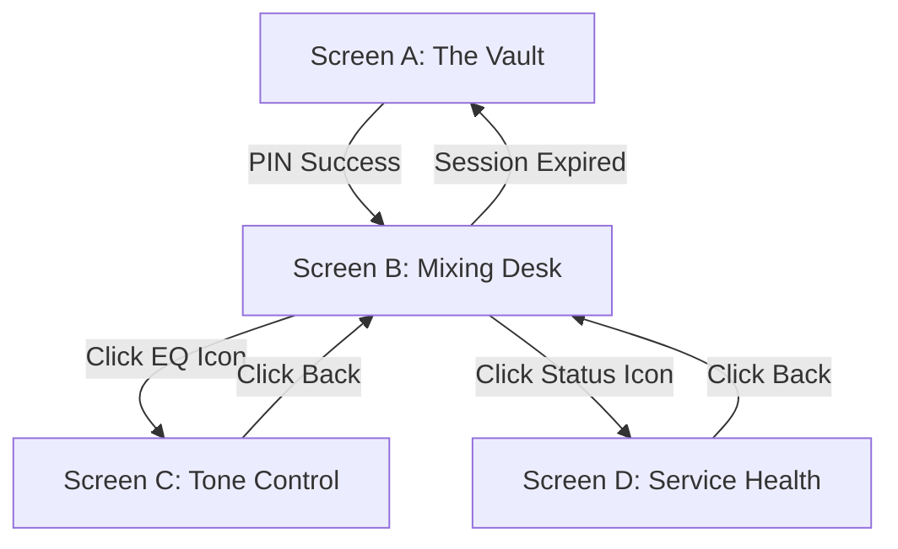

# Visual App Flows & UI Mockups

This document provides a visual representation of the application screens and the navigation flow between them.

---

## 1. Application Navigation Flow



---

## 2. UI Mockups (Low-Fidelity)

### Screen A: The Vault (Login)
*Goal: Secure access with minimal friction.*

```text
+---------------------------------------+
|                                       |
|             [ SECURE ACCESS ]         |
|                                       |
|                [ * * * * ]            |
|                                       |
|             1       2       3         |
|             4       5       6         |
|             7       8       9         |
|                     0                 |
|                                       |
|          [ UNLOCK CONSOLE ]           |
|                                       |
+---------------------------------------+
```

### Screen B: The Mixing Desk (Main View)
*Goal: Balance inputs and control master volume.*

```text
+---------------------------------------+
| [O] HEALTH                    [EQ] >  |
+---------------------------------------+
|  INPUT MIXER           MASTER VOLUME  |
|                                       |
|  [||]      [||]            /-----\    |
|  [||]      [||]           |   X   |   |
|  [||]      [||]            \-----/    |
|  [||]      [||]               |       |
|  [--]      [--]             ( 82% )   |
|                                       |
|  MUTE      MUTE           [ BYPASS ]  |
|  (TT)      (AP)             (EQ)      |
+---------------------------------------+
```

### Screen C: Tone Control (EQ Panel)
*Goal: Fine-tune the audio profile with a balanced, single-screen rack layout.*

```text
+---------------------------------------+
| < MIXER            [ HEALTH ]         |
+---------------------------------------+
|  10-BAND PRECISION EQUALIZER          |
|                                       |
|  |  |  |  |  |  |  |  |  |  |         |
|  |  |  |  |  |  |  |  |  |  |         |
|  O  O  O  O  O  O  O  O  O  O         |
|  |  |  |  |  |  |  |  |  |  |         |
|  |  |  |  |  |  |  |  |  |  |         |
| 32 64 125 250 500 1k 2k 4k 8k 16k     |
|                                       |
|            [ RESET FLAT ]             |
+---------------------------------------+
```

### Screen D: Service & Health (Admin)
*Goal: Diagnostics and quick restarts.*

```text
+---------------------------------------+
| < BACK TO MIXER                       |
+---------------------------------------+
| SYSTEM SERVICES                       |
|                                       |
| [v] Turntable Loop (Running)          |
| [v] AirPlay Receiver (Running)        |
|                                       |
| +-----------------------------------+ |
| | > ALSA: Loopback active 44.1kHz   | |
| | > Shairport: Session connected    | |
| +-----------------------------------+ |
|                                       |
|        [ !!! RESTART AUDIO !!! ]      |
|           (2-tap confirmation)        |
+---------------------------------------+
```

---

## 3. Interaction Behaviors

1.  **Comprehensive Haptics:** Every meaningful interaction provides a subtle vibration on mobile devices to simulate a physical mixing desk (e.g., 5ms for slider movement/navigation, 15ms for muting, 20ms for login).
2.  **Optimistic UI:** State changes (like muting a source or moving a slider) are rendered instantly on the client, avoiding network-induced latency, and subsequently synced to the backend in the background.
3.  **Color Coding:** 
    *   **Red:** Muted state or Stopped service.
    *   **Green:** Active signal or Running service.
    *   **Blue/Gold:** Main interactive elements (Knobs/Sliders).
4.  **Real-time Sync:** If the volume is changed on an iPad, the slider on the iPhone updates via 3-second backend polling.

---

## 4. Visual Component Library

### A. The "Gold & Charcoal" Palette
*   **Background:** `#121212` (Deep Charcoal).
*   **Panels:** Glassmorphism (Semi-transparent with blur) - `rgba(30, 30, 30, 0.7)`.
*   **Accent (Interactive):** `#FFD700` (Metallic Gold) or `#00AEEF` (Electric Blue).
*   **Warning/Mute:** `#FF4B2B` (Glowing Red).

### B. Vertical Faders (Turntable & AirPlay)
*   **Track:** Dark recessed groove with scale markings (-60dB to 0dB).
*   **Thumb:** Brushed aluminum texture (square handle).
*   **Behavior:** Smooth acceleration; logarithmic scale for natural volume feel.

### C. Master Volume Rotary Knob
*   **Visual:** Large circular dial with a single gold "dimple" for orientation.
*   **Ring:** An outer LED ring that glows brighter as volume increases.
*   **Interaction:** Circular drag or click-and-drag upward/downward.

### D. Audio Toggle Buttons
*   **Style:** Recessed square "physical" buttons.
*   **State:** When active, the icon inside glows (e.g., Mute icon turns Red).
*   **Transitions:** 200ms ease-in-out for all state changes.

### E. Equalizer Sliders
*   **Slim Profile:** Thin vertical tracks to fit 10 bands on a mobile screen.
*   **Center Detent:** A visual "notch" at 0dB (66% level) for quick centering.
*   **Live Feedback:** Small "spark" animation at the frequency peaks if the backend supports real-time level monitoring.

### F. Icons (Heroicons/Lucide)
*   **Turntable:** `Disc` or `Music` icon.
*   **AirPlay:** `Airplay` or `Radio` icon.
*   **Settings:** `Sliders` icon.
*   **Health:** `Activity` or `ShieldCheck` icon.
