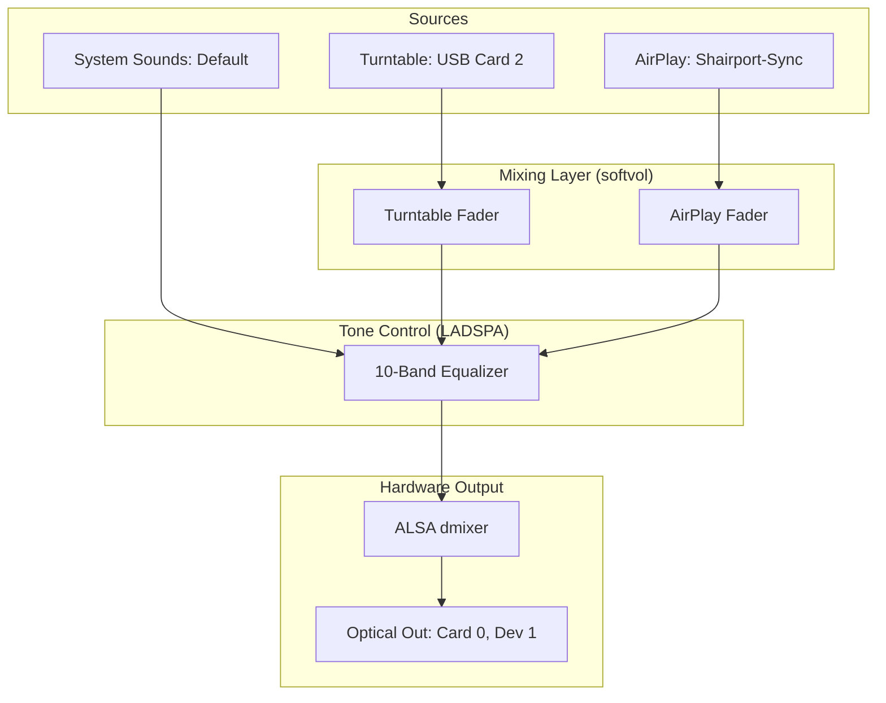
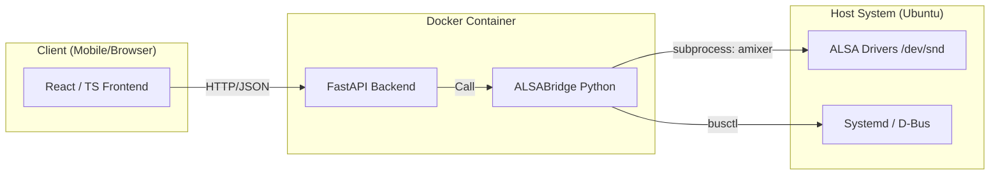
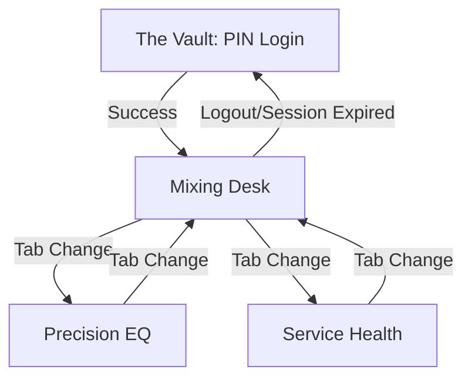

# Plan: Turntable & AirPlay Web Control Interface [COMPLETED]

## Goal
Create a "Friendly User Mode" web interface to control the entire audio signal chain from any device on the local network, with a secure authorization layer.

---

## 1. Architectural Overview & Signal Flow (Implemented)

The application manages a tiered audio architecture:

### 1.1 Audio Signal Flow (The Physics)
This diagram shows how audio is funneled through the system to ensure Mixer and EQ processing.

### 1.2 System Logic Flow (The Bridge)
This diagram shows the relationship between the client, the containerized backend, and the host hardware.

---

## 2. Key Features & Navigation (Verified)

### 2.1 Navigation Flow
The interface is designed for minimal friction, moving from a secure vault to the active mixing console.

- [x] **Secure Access:** Login screen with PIN entry and cookie-based sessions.
- [x] **Input Mixing:** Vertical faders for Turntable and Master control.
- [x] **10-Band EQ:** Panoramic slider panel for tone adjustment.
- [x] **Health Dashboard:** Service status monitoring for `turntable-loop` and `shairport-sync`.
- [x] **Global Reset:** One-tap restart functionality for the audio engine.

---

## 3. Technical Implementation (Production Ready)
...

### Backend (Python/FastAPI)
- **Status:** Live on Port 9000.
- **Features:** Hardware-as-Source-of-Truth ALSA Bridge, Secure Auth, and Static File serving.

### Frontend (React + TS + Tailwind)
- **Status:** Compiled and served via FastAPI.
- **Design:** Gold & Charcoal "Mixing Desk" aesthetic.

### Dockerization
- **Status:** Multi-stage build deployed via `docker compose`.
- **Networking:** Host-mode for native mDNS/AirPlay support.
- **Firewall:** Port 9000 opened in UFW.
