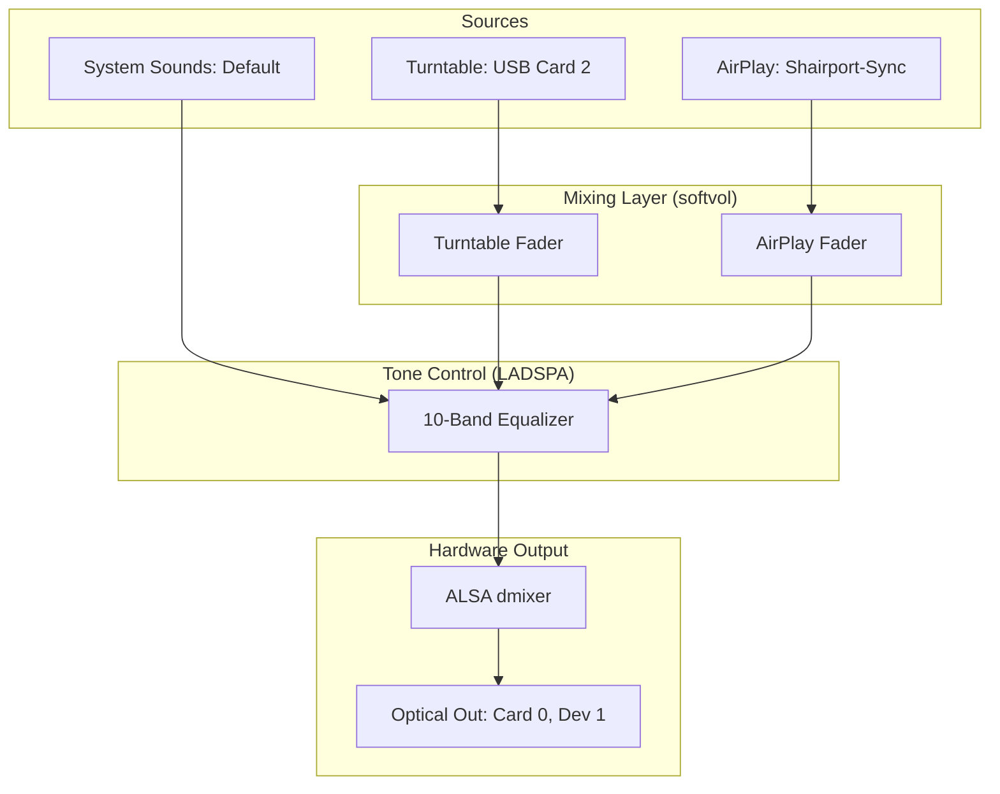
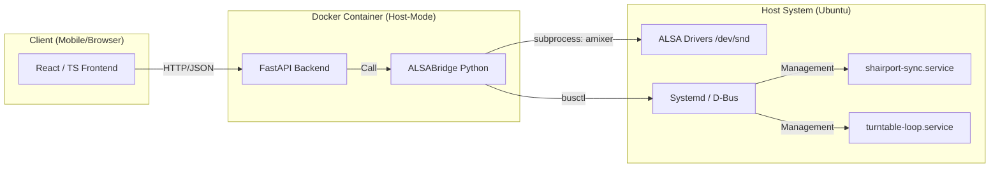

# Project Summary: Optic Sound (Short-term Memory)

## Overview
Optic Sound is a high-fidelity audio control system designed to bridge a physical Reference USB Turntable turntable and an AirPlay receiver into a unified, web-controllable audio chain. It features a custom "Mixing Desk" interface for real-time volume, equalization, and service management.
## Architecture

### 1. Audio Signal Flow (The Physics)
This diagram shows how audio is funneled through the system to ensure Mixer and EQ processing.

### 2. Software Stack (The Logic)
This diagram shows the relationship between the web interface, the backend bridge, and the host system.

## Key Features
...
- **Simplified Global Control:** Single "Mute System" CTA for instant silencing of all audio paths.
- **Independent Mixing:** Separate faders for Turntable gain and AirPlay volume.
- **10-Band EQ:** Global tone control via LADSPA `equal` plugin.
- **Tactile UI:** Optimized for mobile touch with 60fps animations and haptic feedback.
- **Service Management:** Direct control of host services (`shairport-sync`, `alsaloop`) via D-Bus.

## Current State (v3.3.1)
- **Deployment:** Active on `http://optic-sound.local:9000`.
- **UI:** Refined "Tactile Focus" layout with **Absolute State Persistence**.
- **Themes:** Support for both **Light** and **Night** environments with persistent user preference.
- **EQ Stability:** Resolved "jumping" slider bug and refactored bands to 32Hz/64Hz nomenclature.
- **EQ State Sync:** Unified ALSA EQ state across Docker and Host via shared `/var/lib/alsa/equalizer.bin`.
- **EQ UI:** Enhanced 0dB reference line visibility with theme-optimized contrast (80% opacity in Light mode).
- **Security:** LAN-restricted via UFW (192.168.1.0/24).
- **Stability:** Coordinated master control logic remains in backend for API reliability.
- **Testing:** 21 automated tests passing (17 Backend, 4 Frontend).

## Recent Progress
- **Visual Documentation:** Integrated high-fidelity screenshots of the Mixer, EQ, and Diagnostic panels into the project documentation.
- **Static Assets:** Moved screenshots to `frontend/public/` for availability as web assets and updated the `README.md` gallery.
- **Light Theme Visibility:** Optimized the 0dB guide lines for the Light theme, increasing contrast to ensure they are clearly visible in bright environments.
- **Theme Support:** Added a new **Light Environment** mode. The app now supports toggling between Light and Night themes with a dedicated button in the header.
- **Unified EQ State:** Resolved the "Inaudible EQ" bug by synchronizing ALSA state between the Docker container and host services using a shared binary file.
- Resolved UI "jumping" with an **Absolute Manual Override** system, guaranteeing slider state persistence across tab switches.
- Simplified Mixing Desk UI by removing Master volume sliders, leaving a focused "Mute System" CTA.
- Implemented **Coordinated Master Control** to simultaneously adjust multiple signal paths.
- Refactored sliders to a **Thumb-First** tracking model for better mobile ergonomics.
- Migrated service management to **Direct D-Bus** for host-level reliability.
