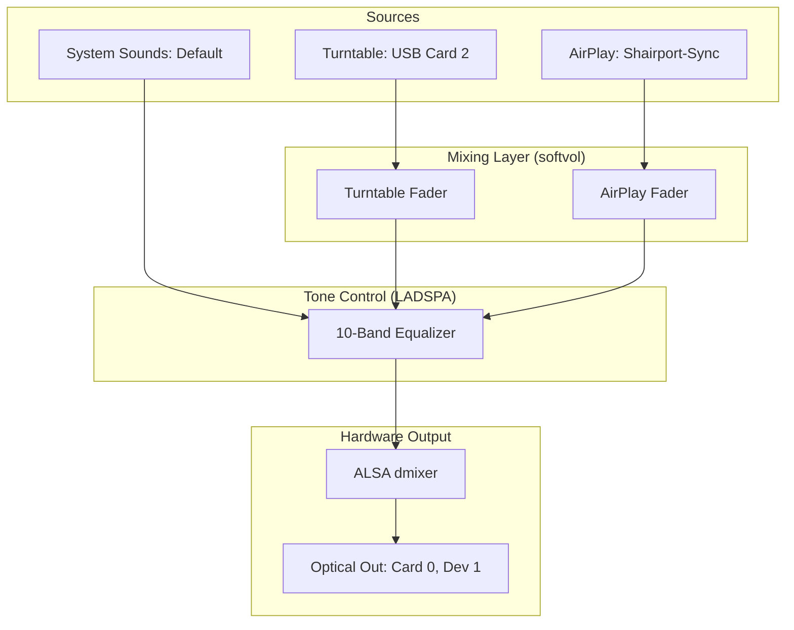

# Chapter 1: The AI-Native Shift – Vision, Architecture, and Agent Initialization

---
**[← Back to Table of Contents](index.md)** | **[Next Chapter →](chapter_2_alsa.md)**
---

Welcome to the new era of software engineering. This chapter isn't just about audio; it's about the **AI-Native Shift**—moving from being a "coder" to being a "System Orchestrator." 

Whether you are just starting your journey with AI agents or you are an experienced developer looking for a **predictable framework**, this guide will show you how to turn a complex hardware vision into a rock-solid reality.

## 1.1 The Hardware Vision: Why Start Here?

Most AI tutorials focus on simple Todo apps. We chose an **Reference USB Turntable Turntable** because it represents the ultimate challenge for an AI agent: **managing physical state.**

### The Problem Space
*   **The Physics:** USB input (Card 2) ➔ Optical motherboard output (Card 0).
*   **The Digital:** Simultaneous mixing of AirPlay (Shairport-Sync) and Analog Vinyl.
*   **The UX:** A tactile, zero-latency interface that feels like a $550 mixing console.

**Why this matters for you:** If you can teach an AI to manage Linux kernel audio routing and physical hardware latency, you can build *anything*.

## 1.2 The Audio Funnel: Communicating Complexity

To achieve **predictable results**, you cannot just "chat" with an AI. You must provide a mathematical or visual baseline. This Mermaid diagram is our "Source of Truth."

## 1.3 Tactical Prompting: Setting the Workspace

The difference between a successful project and a messy failure lies in the **Initialization**. Don't let the agent guess your structure—dictate it.

> **MASTERCLASS PROMPT 1: WORKSPACE INITIALIZATION**
> "Act as a Senior System Architect. We are building 'Optic Sound', a high-fidelity audio controller. I am your Human Partner. 
> 
> 1. Create a professional directory structure in `~/optic-sound`: `backend/`, `frontend/`, `docker/`, and `diagnostics/`.
> 2. Initialize a `GEMINI.md` file. This is your 'Global Mandate'. Write down these rules: 'FastAPI for backend, React/TS for frontend, Hardware is the source of truth, absolute paths only.'
> 3. Create a `PLAN.md` with a checkbox list of the 7 chapters of this book.
> 4. Generate a `set_permissions.sh` script to normalize UID 1000 across Docker and Host environments."

## 1.4 The Anonymization Strategy: Designing for Scale

A key lesson for experts: **Stop hardcoding your username.** If you want your agentic projects to be portable (deployable to any server), you must enforce universal paths.

**Key Tactic:** Use the `setgid` bit (`chmod g+s`) on all directories. This ensures that when your AI agent creates a file, it automatically inherits the correct group permissions, preventing the "Permission Denied" nightmare common in containerized hardware apps.

---
**[← Back to Table of Contents](index.md)** | **[Next Chapter →](chapter_2_alsa.md)**

---
*© 2026 Michael Untershlak. All rights reserved.*
