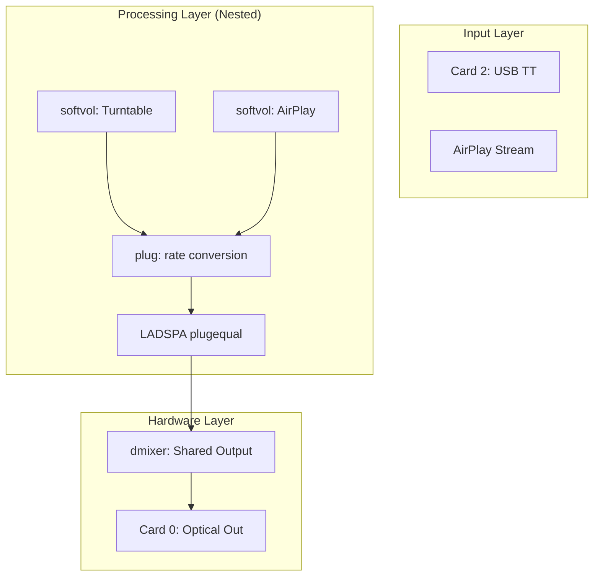

# Chapter 2: Taming the Engine – ALSA Engineering

---
**[← Back to Table of Contents](index.md)** | **[← Previous Chapter](chapter_1_foundations.md)** | **[Next Chapter →](chapter_3_backend.md)**
---

Welcome to the "engine room." In this chapter, we take our high-level vision and dive deep into the Linux kernel's audio stack. This is where we learn the most important lesson of hardware apps: **you can't fix physics with pure logic.**

## 2.1 Logic vs. Physics: The Great Mismatch

When building audio apps, the biggest hurdle is that the software's "Logic" often conflicts with the hardware's "Physics." Agents cannot "hear" audio; they rely entirely on you to establish the correct physical parameters.

### The PHONO vs. LINE Trap (Issue #1)
- **Problem:** Signal loss and extreme noise during the first test.
- **Cause:** The turntable switch was set to PHONO (raw, unamplified).
- **Decision:** Switch to **LINE** to utilize the turntable's internal preamp. **Rule for Agents:** Document that physical hardware switches MUST be validated before debugging software volume levels.

### The Background Noise Battle (Troubleshooting)
- **Problem:** Persistent electronic hiss and background "whine."
- **Mitigation A:** Run `alsamixer -c 0` and mute unused analog inputs (Line-In, Mic).
- **Mitigation B:** Increase `alsaloop` latency to 200ms (`-t 200000`) and enable double buffering (`-b`).

## 2.2 Deep Dive into `asound.conf`: The Audio Funnel

The `asound.conf` file is where the magic happens. We use it to create "Virtual Devices" that handle the mixing.

### The "No Sound" Crisis (Issue #2)
- **Problem:** `alsaloop` failed to initialize with `softvol`, reporting "Unknown PCM" and "Slave PCM not usable."
- **Decision 1 (Visibility):** Added `hint { show on }` blocks. Without these, custom PCMs are invisible to systemd services.
- **Decision 2 (Stability):** Wrapped `softvol` in **nested `plug` layers** (`plug` -> `softvol` -> `plug` -> `dmix`). This is critical for negotiating sample rate differences (48kHz capture vs 44.1kHz playback).

### The Hybrid Strategy (Architectural Decision)
- **Issue:** Fatal crashes occurred when nesting multiple software volume plugins within the EQ chain.
- **Decision:** Use a **Hybrid approach**. AirPlay uses software volume (slaved to EQ), while the Turntable uses **Direct Hardware Gain** (Card 2 `PCM`). This maintains stability while keeping high audio fidelity.

### Agent Prompt: ALSA Configuration
> **AGENT RECONSTRUCTION PROMPT 2: THE ALSA ENGINE**
> "Write the complete `/etc/asound.conf`. It must include:
> 1. A `dmixer` bound to `hw:0,1` (Optical Out).
> 2. A `plugequal` LADSPA equalizer feeding into the dmixer. The state file MUST be located at `/var/lib/alsa/equalizer.bin`.
> 3. A `softvol` device named 'AirPlay' feeding into the equalizer.
> 4. Ensure all custom devices have `hint { show on }`.
> 5. Create a `pcm.!default` that routes standard audio through the EQ."

## 2.3 Visualizing the Engine: The Nested Plugin Stack

A stable ALSA setup requires "plug" layers to bridge sample rate differences. Feed this to the agent so it understands the necessary nesting depth:



## 2.4 The Loopback Service

To get audio from the USB Turntable into the ALSA stack, we must run an `alsaloop` daemon. 

### Agent Prompt: The Systemd Daemon
> **AGENT RECONSTRUCTION PROMPT 3: HARDWARE DAEMON**
> "Create a systemd service file named `turntable-loop.service`. It must run as the standard user (not root). The ExecStart command should run `alsaloop` capturing from `hw:2,0` (Turntable) and playing to the `plug:equal` (or the default EQ device). Use flags `-t 200000` (200ms latency), `-b` (double buffering), and `-S 1` (strict sync)."

**Exact implementation reference for `turntable-loop.service`:**
```ini
[Unit]
Description=Turntable ALSA Loopback Bridge
After=sound.target

[Service]
Type=simple
User=<YOUR_USER>
ExecStart=/usr/bin/alsaloop -C hw:2,0 -P plug:equal -t 200000 -b -S 1
Restart=on-failure
RestartSec=3

[Install]
WantedBy=default.target
```

---
**[← Back to Table of Contents](index.md)** | **[← Previous Chapter](chapter_1_foundations.md)** | **[Next Chapter →](chapter_3_backend.md)**

---
*© 2026 Michael Untershlak. All rights reserved.*