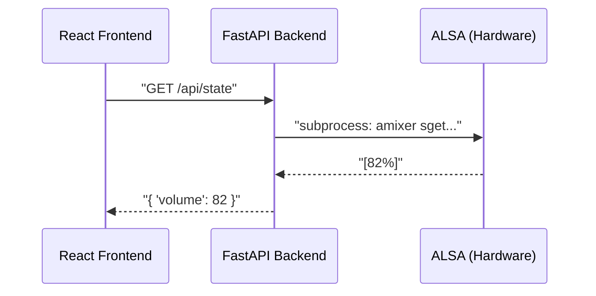

# Chapter 3: The Digital Bridge – FastAPI & Hardware Logic

---
**[← Back to Table of Contents](index.md)** | **[← Previous Chapter](chapter_2_alsa.md)** | **[Next Chapter →](chapter_4_frontend.md)**
---

How do you translate a user's tap on a screen into a physical voltage change on a motherboard? In this chapter, we build the **Digital Bridge** using Python and FastAPI. This is where the project gets "smart."

## 3.1 Architecture: Hardware as the Source of Truth

A common mistake in IoT apps is keeping a separate database for the "Volume" state. If someone changes the volume using a physical knob or a terminal command, the app gets out of sync.

**The Solution:** The backend should never "remember" the volume. It should query the hardware (ALSA) every time the UI asks.

### The Simulated Mute (Troubleshooting)
- **Issue:** Muting the Turntable or AirPlay in the app had no effect because the underlying `softvol` devices lacked a physical hardware mute switch (`pswitch`).
- **Solution:** Implemented **Simulated Mute** logic in the `ALSABridge`. When a mute request is received, the backend captures the current volume, sets the hardware level to 0%, and restores the previous level upon unmuting.

## 3.2 The `ALSABridge` Class & Environment Stability

We use Python's `subprocess` module to wrap `amixer` commands. This allows us to treat ALSA like a simple Python object.

### Missing Plugins in Docker (Issue #3)
- **Problem:** Backend logs showed persistent "Invalid CTL equal" errors.
- **Cause:** The Docker container lacked the `libasound2-plugin-equal` library required to talk to the EQ.
- **Fix:** Update the `Dockerfile` to include all necessary LADSPA and ALSA plugins.

**Lesson Learned: Unbuffered Logging**
When running in Docker or as a background service, Python often buffers `print()` statements, making debugging hardware actions impossible. Always use `print(..., flush=True)` or set the environment variable `PYTHONUNBUFFERED=1`.

### Agent Prompt: ALSA Bridge Logic
> **AGENT RECONSTRUCTION PROMPT 4: PYTHON ALSA WRAPPER**
> "Write a Python class `ALSABridge` in `backend/alsa_bridge.py`. 
> 1. Use `subprocess.run` to execute `amixer` commands.
> 2. Implement a `get_system_state()` method that parses `amixer sget` to return a JSON dictionary of current volumes (master, turntable, airplay) and EQ bands (10 bands, mapped from 31Hz to 16kHz).
> 3. Implement 'Simulated Mute' logic: if a device doesn't have a mute switch, store its volume, set to 0, and restore it later.
> 4. Use `busctl` (D-Bus) to restart the `shairport-sync` and `turntable-loop` systemd services."

## 3.3 D-Bus: Beyond systemctl & Routing Priority

### The API Interception Bug (Issue #4)
- **Problem:** Static file serving was intercepting API calls (like `/api/login`), causing "405 Method Not Allowed" errors.
- **Decision:** Move the static mount to the **end** of the FastAPI application lifecycle. This ensures that explicit API routes have priority over the compiled frontend assets.

### D-Bus Service Management
Our app needs to restart services like `shairport-sync` (AirPlay). In a Dockerized or universal Ubuntu environment, using `sudo systemctl restart` inside a script is often restricted or unreliable.

**The Pro Tip:** Use **D-Bus** via the `busctl` command. It allows the backend to talk directly to the system manager via a mounted socket, providing 100% accurate service status monitoring.

### Agent Prompt: FastAPI Server
> **AGENT RECONSTRUCTION PROMPT 5: THE REST API**
> "Write `backend/main.py` using FastAPI.
> 1. Define endpoints: `POST /api/login`, `GET /api/state`, `POST /api/volume/{source}`, `POST /api/mute/{source}`, `POST /api/eq`, and `POST /api/system/restart`.
> 2. Use `ALSABridge` to fulfill these requests.
> 3. Implement a simple cookie-based authentication dependency (`Depends(get_current_user)`). The PIN should be read from an `ACCESS_PIN` environment variable.
> 4. Mount a `static/` directory at the root (`/`) to serve the React frontend, but ensure this mount happens *after* all API routes are defined."

## 3.4 Visualization: The Request Flow

Provide this to the agent to clarify the expected latency and sync process:

---
**[← Back to Table of Contents](index.md)** | **[← Previous Chapter](chapter_2_alsa.md)** | **[Next Chapter →](chapter_4_frontend.md)**

---
*© 2026 Michael Untershlak. All rights reserved.*