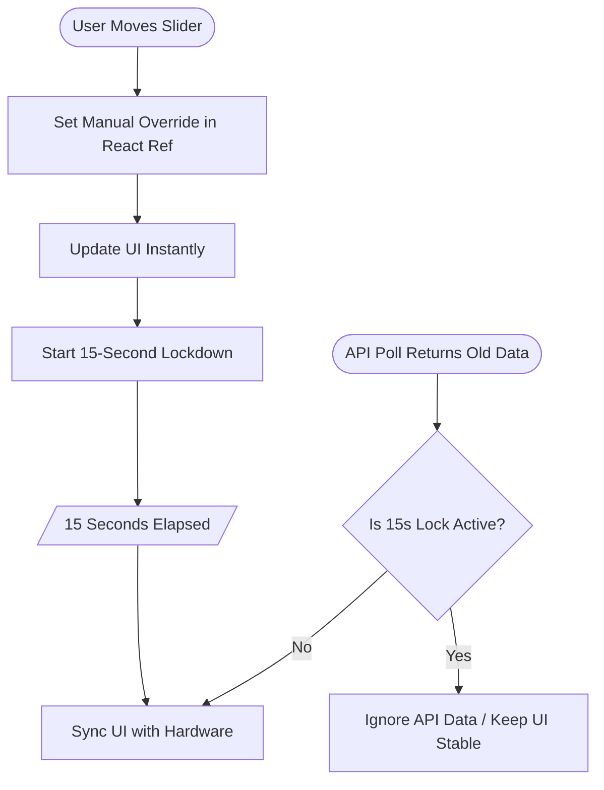

# Chapter 4: The Tactile Interface – React & Modern UX

---
**[← Back to Table of Contents](index.md)** | **[← Previous Chapter](chapter_3_backend.md)** | **[Next Chapter →](chapter_5_deployment.md)**
---

Audio is tactile. If the UI feels sluggish, the sound *feels* worse. In this chapter, we transition from backend logic to high-performance UX, building a React interface that responds with the snap and precision of a $550 physical mixing desk.

## 4.1 The "Gold & Charcoal" Aesthetic

For an audiophile app, the visual design must reflect the quality of the sound. We used **Tailwind CSS** to create a dark, high-contrast theme:
*   **Background:** Deep Charcoal (`#121212`).
*   **Accents:** Metallic Gold and Electric Blue.
*   **Typography:** Ultra-thin, tracking-heavy headers for a "technical" feel.

### The CSS Purging Crisis (Issue #5)
- **Problem:** Styles were not loading in production, resulting in an "ugly" UI.
- **Cause:** Tailwind was purging necessary classes because the `content` glob in `tailwind.config.js` was too restrictive.
- **Fix for Agents:** Ensure the Tailwind configuration explicitly includes all React source files: `content: ["./index.html", "./src/**/*.{js,ts,jsx,tsx}"]`.

## 4.2 The Thumb-First Slider Model

Native HTML5 `<input type="range">` elements are problematic on mobile. They are difficult to grab and often trigger page scrolling instead of changing the volume.

**The Solution:** Build a custom React slider that listens to `touchstart` and `touchmove` events directly. 
*   **Locking:** Use `e.preventDefault()` to lock the screen while dragging.
*   **Hit Zones:** Add invisible padding around the slider to make it "easy to grab" with a thumb.

### Agent Prompt: The Custom Slider
> **AGENT RECONSTRUCTION PROMPT 6: TACTILE SLIDER COMPONENT**
> "Write a React component `VerticalSlider.tsx`. It must NOT use `<input type='range'>`. 
> 1. Use a generic `div` with `onTouchStart`, `onTouchMove`, and mouse equivalents to track the Y-coordinate.
> 2. Calculate the percentage (0-100) based on the bounding client rect.
> 3. When dragging, bypass React state updates for the visual position if possible, or use a highly optimized local `dragValue` state to ensure 60fps rendering without waiting for backend network requests.
> 4. Trigger `window.navigator.vibrate(5)` on every distinct value change."

## 4.3 Haptic Feedback & Theme Harmony

### Dual Environment Support (New Feature)
- **Action:** Implemented a theme system supporting both **Night (Dark)** and **Light (Day)** modes.
- **UX Decision:** Added smooth 500ms color transitions and haptic confirmation for theme toggling.

### Visibility Troubleshooting
- **Problem:** The 0dB guide lines (crucial for "Flat" EQ) were nearly invisible in Light mode.
- **Fix:** Increased guide line opacity to **80%** in Light mode and used a darker **Blue-600** for the AirPlay fader to ensure contrast against light backgrounds.

## 4.4 The 15-Second State Persistence Rule

One of the hardest bugs to solve was the "Jumping Slider." When you move a slider, the backend takes a moment to update the hardware. If the app polls the state during this window, it might receive the *old* value and snap the slider back to its previous position.

### The Nested State Bug (Troubleshooting)
- **Issue:** EQ sliders continued to "jump" even after the override system was built.
- **Cause:** The `manualOverrides` system was treating EQ updates as top-level properties instead of nesting them inside the `equalizer` state object.
- **Decision:** Refactor the override logic to recursively merge nested hardware states.

### Visualizing Absolute State Persistence

We use a "Manual Override" strategy to shield the UI from stale hardware data:

### Agent Prompt: State Management Architecture
> **AGENT RECONSTRUCTION PROMPT 7: STATE INTEGRITY (App.tsx)**
> "Write the main `App.tsx` routing and state management.
> 1. Set up a polling interval `setInterval(fetchState, 5000)` to query `/api/state`.
> 2. Implement the **Absolute Override System**: Create a `useRef` dictionary tracking the timestamp of user interactions.
> 3. When `fetchState` receives new data, deeply merge it with the `useRef` overrides. If an override is less than 15 seconds old, the override value MUST win, completely ignoring the API's hardware value.
> 4. Add the 'Vault' UI screen that requires the user to input a 4-digit PIN before accessing the Mixer."

---
**[← Back to Table of Contents](index.md)** | **[← Previous Chapter](chapter_3_backend.md)** | **[Next Chapter →](chapter_5_deployment.md)**

---
*© 2026 Michael Untershlak. All rights reserved.*