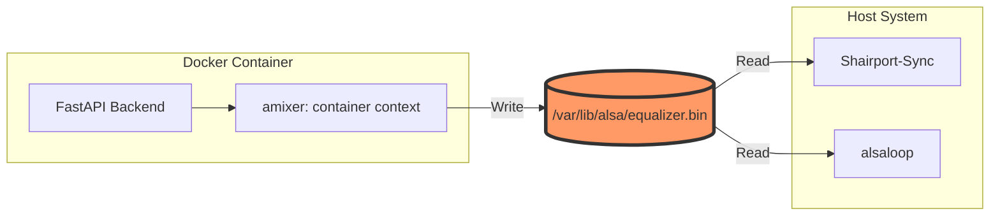

# Chapter 5: Production Hardening – Docker & Portability

---
**[← Back to Table of Contents](index.md)** | **[← Previous Chapter](chapter_4_frontend.md)** | **[Next Chapter →](chapter_6_agentic_workspace.md)**
---

It's time to leave the "Development Sandbox." In this chapter, we take our fragile local setup and wrap it in a **Production-Grade Shield**. We'll learn how to build containers that can control hardware on any universal Ubuntu server with a single command.

## 5.1 Hardware Access in Docker

Docker containers are isolated by default. To control audio, the container needs direct access to the host's sound hardware.

**The Solution:**
1.  **Device Mapping:** Mount `/dev/snd` into the container.
2.  **Configuration:** Mount the host's `/etc/asound.conf`.
3.  **Network Mode:** Use `network_mode: host` to ensure mDNS and AirPlay services are visible on the local network.

### Network Security (Troubleshooting)
- **Issue:** Port 9000 was initially open to "Anywhere," posing a risk on public networks.
- **Fix:** Restrict **UFW rules** to only allow traffic from the local subnet (e.g., `192.168.1.0/24`). The control panel is now invisible to anything outside your home network.

## 5.2 The Multi-User Sync & Permission Challenge

### The "Inaudible EQ" Crisis (Issue #6)
- **Problem:** EQ changes made in the web UI had zero effect on the audio.
- **Cause:** The `alsaequal` plugin defaults to storing state in `~/.alsaequal.bin`. Since Docker, Shairport-Sync, and the audio loop were running as different users, they were looking at different state files.

### Visualizing the Shared State Architecture

To synchronize the Docker container with the Host services, we use a shared volume with broad permissions:

**The Fix:**
*   Point all ALSA configs to a shared file: `/var/lib/alsa/equalizer.bin`.
*   Mount this directory as a volume in Docker.
*   Set permissions to `666` so all users/contexts can read/write to the same "Truth."

### Automated Permission Enforcement
- **Issue:** Files created by services were sometimes owned by root, causing permission denied errors.
- **Decision:** Created a `set_permissions.sh` script using the **setgid bit** on the project directories. This ensures all new files automatically inherit the correct group permissions, regardless of which user created them.

## 5.3 CI/CD & Production Hardening

### The Multi-Stage Build Strategy
Instead of shipping a heavy development environment, we use a **Multi-Stage Dockerfile**:
1. **Stage 1 (Node):** Builds the React frontend.
2. **Stage 2 (Python):** Bundles the compiled assets into a slim FastAPI image.

### Zero-Bug Deployment (Decision)
- **Action:** Updated the `Dockerfile` to automatically run all **automated tests** (Frontend & Backend) *before* the build is finalized. If a single test fails, the build stops. This guarantees that only verified code reaches the production server.

## 5.4 The Final Agent Prompts

> **AGENT RECONSTRUCTION PROMPT 8: THE MULTI-STAGE DOCKERFILE**
> "Create a `Dockerfile`.
> 1. Stage 1 (builder): Use `node:20-alpine`. Copy `frontend/`, run `npm install`, and `npm run build`.
> 2. Stage 2 (runner): Use `python:3.12-slim`. Install `alsa-utils`, `libasound2-plugin-equal`, `swh-plugins`, and `dbus`.
> 3. Copy `backend/` and install `requirements.txt`.
> 4. Copy the built React assets from Stage 1 into the `static/` directory of the Python app.
> 5. Set the entrypoint to run the FastAPI app via `uvicorn` on port 9000."

> **AGENT RECONSTRUCTION PROMPT 9: SERVICE ORCHESTRATION**
> "Create `docker-compose.yml`.
> 1. Build the current context.
> 2. Use `network_mode: host`.
> 3. Mount `/dev/snd:/dev/snd` as a device.
> 4. Mount `/etc/asound.conf:/etc/asound.conf:ro` as a read-only volume.
> 5. Mount `/var/lib/alsa:/var/lib/alsa` as a read-write volume.
> 6. Mount `/var/run/dbus/system_bus_socket:/var/run/dbus/system_bus_socket` so Python can control systemd.
> 7. Load variables from a `.env` file."

## 5.5 Final Checklist for the Universal Ubuntu Server

1.  **Permissions:** Run `set_permissions.sh` to ensure the generic UID 1000 can access the audio devices and state files.
2.  **UFW Security:** Restrict port 9000 to your local subnet (`192.168.1.0/24`).
3.  **Environment Management:** Centralize all hardware indices in a `.env` file within the `docker/` directory for easy orchestration.

---
## 🏁 Conclusion: The Path Forward

You have built a high-fidelity, tactile, and secure audio controller from scratch using Gemini. You've mastered the gap between physical hardware and modern web tech. This manual ensures that the entire stack can be instantly rebuilt, modified, and scaled by any autonomous agent.

**Now, go build something that sounds beautiful.**

---
**[← Back to Table of Contents](index.md)** | **[← Previous Chapter](chapter_4_frontend.md)** | **[Next Chapter →](chapter_6_agentic_workspace.md)**

---
*© 2026 Michael Untershlak. All rights reserved.*